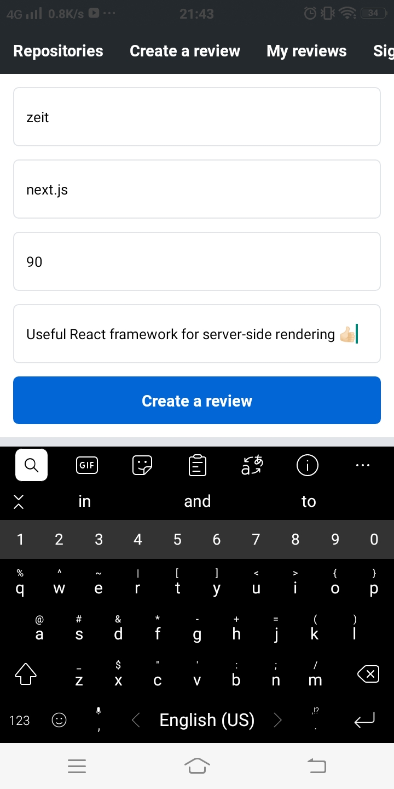

# RATE REPOSITORY APP
_A small application for Android and iOS using React Native._  

## Table of Contents
- [Overview](#Overview)
- [Installation](#Installation)
- [Features](#Features)
- [Techniques](#Techniques)
- [Issues](#Issues)
- [Todo](#Todo)
- [Acknowledgement](#Acknowledgement)
- [Certificate](#Certificate)

## Overview
- [**Rate Repository App**][repo-link] is a React Native application which allows users to interact with Github repositories, for example, check, rate and review an repo, manage review history,...  
- The app are built from bottom up using [**React Native**][react-native-website] with the help of [**Expo**][expo-website] to bundle and deploy the app, [**GraphQL**][graphql-website] to communicate with the back-end, [**Formik**][formik-website] and [**yup**][yup-repo-link] to create forms,...
-  Since the back-end [**Rate Repository API**][back-end-repo] is _provided_ and _used_ **AS-IS** without any modification, [**Rate Repository App**][repo-link] is using mock data. However, the mock data can be changed to any set at will.
- _Some features are only available on mobiles devices. So, use mobile devices rather than browsers to test the app._

## Installation
- Set up the back-end server with [**Rate Repository API**][back-end-repo].
- Clone this repo. _screenshots folder can be deleted_.
- Install all the required package with `npm install`.
- Start the [Metro bundler][metro-bundler-website] with `npm start`.
- Use [Expo][expo-website] app on mobile device to run the app.

## Features
- Authorized users can access more features than regular users.   

  

  | Regular user | Authorized user |
  | --- | --- |
  |  |  |

  

- Users can use _Preset Options_ to **sort the repos** and can use the _Searchbar_ to **filter** the result.  

  

  | Preset options | Searchbar |
  | --- | --- | 
  |  |  |   

  

- Each repo can **be visited on Github using browser**    

  

  

  

- An authorized user is able to **give a review** to a repository and **manage their review history**.   

  
   

  | Create a Review | Result | My reviews |
  | --- | --- | --- |
  |  |  |  |  

  

## Techniques
**Repository List** on _Repositories page_, **Review List** on a _specific repo page_ and **Review List** of an user in _My reviews page_ are all applied **Infinite scrolling** feature. Basically, an initial set of data is given to the list to render on the screen. After the user scroll down to the last item, another set of data will be fetched to append to the previous set to extend the list. To implement this feature, **Cursor-based pagination** is applied when making the request to the back-end.     

An example in the code can be found in [`useUser` hook][useUser-hook-link].  

The reason of applying this technique is to reduce the required bandwidth and decrease the memory usage of the application. Unless the user is interested in next items in the list, only a specific number of items is requested.

## Issues
- It is suggested to use [`react-native-picker`][rnp-link] or [React Native Paper's Menu][rnp-menu-link] to create Preset options to sort repositories. However, I could not manage to integrate either of these to the application.   
  - The `react-native-picker` gave an compatible error then another undocumented error.
  - The Menu counterpart showed the options behind the list items. As a result, the options were unable to select.   

  >**Solution**: I created a custom menu for this component

## Todo
- [ ] Show notification if the user tries to login with wrong credentials.
- [ ] Selected page has different indicator rather than have the same style.

## Acknowledgement
- [**Rate Repository App**][repo-link] is the final production  of the [Full Stack open 2020][fullstack-course-link] course - [**React Native**][part-10-link] part.
- Special thanks to:  
  - [The University of Helsinki][helsinki-uni-link] for providing the certificate.
  - [Matti Luukkainen][matti-github-link] and [Kalle Ilves][kalle-github-link] for preparing the content of this awesome part.
  - My laptop and my phone for helping me make this app.

## Certificate

[repo-link]: https://github.com/minhvo-dev/MOOC.fi-React-Native-2020 "Repo link"  
[react-native-website]: https://reactnative.dev/ "React Native website"
[expo-website]: https://expo.io/ "Expo website"
[graphql-website]: https://graphql.org/ "GraphQL website"
[back-end-repo]: https://github.com/Kaltsoon/rate-repository-api 
[metro-bundler-website]: https://facebook.github.io/metro/ "Metro website"
[useUser-hook-link]: https://github.com/minhvo-dev/MOOC.fi-React-Native-2020/blob/master/src/hooks/useUser.js
[formik-website]: https://formik.org/docs/overview "Formik website"
[yup-repo-link]: https://github.com/jquense/yup "yup repo"
[rnp-link]: https://www.npmjs.com/package/react-native-picker-select
[rnp-menu-link]: https://callstack.github.io/react-native-paper/menu.html

[part-10-link]: https://fullstackopen.com/en/part10 "React Native Course link"   
[fullstack-course-link]: https://fullstackopen.com/en/ "Full Stack 2020 Course link"   
[helsinki-uni-link]: https://www.helsinki.fi/fi "The University of Helsinki website"
[matti-github-link]: https://github.com/mluukkai   
[kalle-github-link]: https://github.com/Kaltsoon
